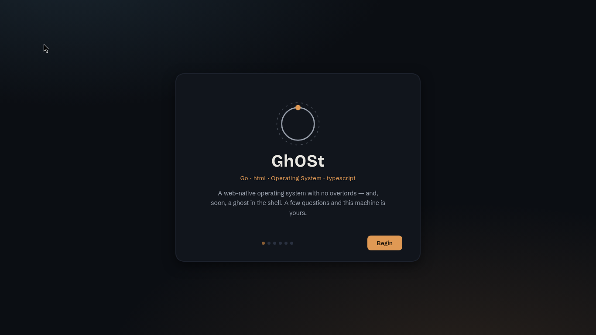
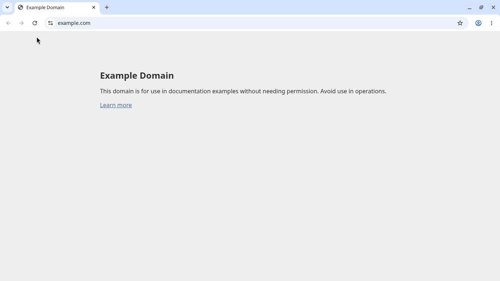
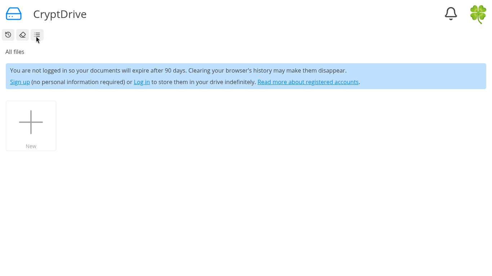
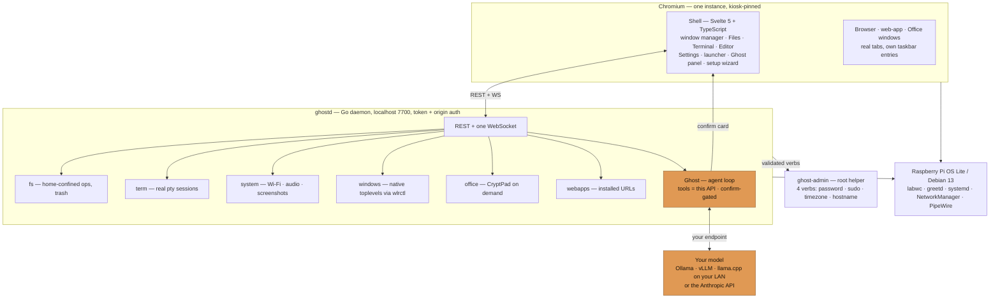
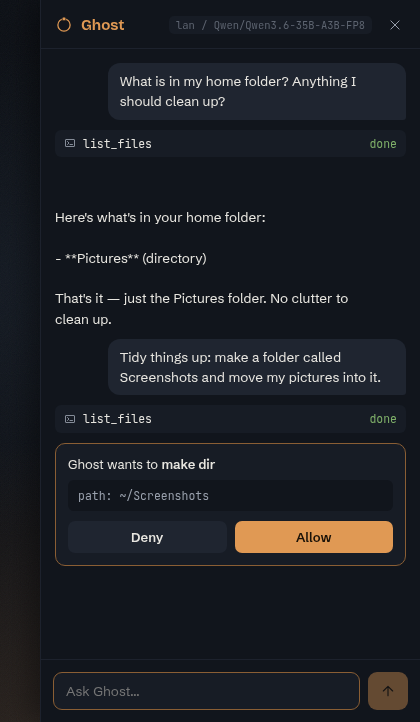

# GhOSt

**G**o · **h**tml · **O**perating **S**ystem · **t**ypescript — with a ghost
in the shell.

GhOSt is an open-source, web-native operating system in the spirit of
ChromeOS, minus the Google. A minimal Linux base boots straight into a
hardware-accelerated Chromium running a desktop built entirely in web tech,
a small Go daemon provides the system underneath, and a resident AI
assistant — **Ghost** — can act on the machine through the same API, gated by
your confirmation, powered by *your* model (local, LAN, or BYO-key cloud).

Target hardware: **Raspberry Pi 400/4** (4 GB, ARM64). Develops anywhere;
a scripted QEMU VM stands in for the Pi.

| First boot | Real browsing | Office (CryptPad) |
| --- | --- | --- |
|  |  |  |

## Architecture



The trick that makes it an OS and not "a browser with system access": the
shell is a chromeless `--app` window pinned as the desktop by a compositor
rule, browsing happens in normal windows of the *same* Chromium instance, and
everything a web page can't do (files, ptys, Wi-Fi, windows, AI tools) goes
through `ghostd`'s authenticated localhost API. Deeper rationale, security
model, and memory budget: [docs/architecture.md](docs/architecture.md) and
[docs/decisions/](docs/decisions/).

## Ghost — the AI layer

Every other OS bolts AI on as a chat sidebar that screenshots the screen.
GhOSt was, almost by accident, designed as an agent harness: `ghostd` already
exposes the whole system as a clean, permission-gated localhost API — which is
*exactly* the tool surface an agentic model needs. So **Ghost's tools ARE the
OS API**: list/read/write/move files, open browser windows, change settings.

<p align="center">
  
</p>

Read-only tools run freely; **every mutating action renders an Allow/Deny card
before it executes** (above: Ghost proposes `make_dir ~/Screenshots`, gated by
the OS — not the prompt). Every answer carries a **provenance badge** showing
exactly which model produced it. The screenshot above is a real session driven
by a self-hosted **Qwen3 on a LAN GPU box** — no cloud, no key, nothing left
the network.

- **Off by default.** An open-source OS must not phone home.
- **Bring your own brain:** any OpenAI-compatible endpoint (Ollama, vLLM,
  llama.cpp) or the Anthropic API. Configured in the setup wizard or
  Settings → Ghost AI (`~/.config/ghost/ai.toml`).
- **Auditable:** the agent loop, tool definitions, and confirmation gate are
  all in this repo ([daemon/internal/ai](daemon/internal/ai)). You can read
  exactly what the assistant can touch.
- **Extensible** — drop-in **skills** (a folder + `SKILL.md`, progressively
  disclosed) and **tools** (a JSON manifest + any executable), no recompile.
  A fresh install ships with a `tidy-files` skill and `system_report` /
  `append_note` tools as working examples. See
  [ADR 0005](docs/decisions/0005-ghost-extensibility.md) and
  [docs/apps.md](docs/apps.md#extending-ghost-the-ai-layer).
- Summon with `Super+Space` or the taskbar ring.

## Quick start

### Dev loop (any OS)

```sh
pnpm install
./scripts/dev.sh        # ghostd :7700 + Vite :5173
open http://localhost:5173        # add #oobe to walk the setup wizard
```

### Dev VM (Apple Silicon)

```sh
curl -fLo ~/ghost-vm/debian-13-arm64.qcow2 \
  https://cloud.debian.org/images/cloud/trixie/latest/debian-13-genericcloud-arm64.qcow2
./scripts/vm-qemu.sh create && ./scripts/vm-qemu.sh start
GHOST_VM=admin@127.0.0.1 GHOST_SSH_PORT=2222 GHOST_SSH_KEY=~/ghost-vm/id_ed25519 \
  ./scripts/deploy-vm.sh
# watch it: vnc://127.0.0.1:5907 · shell: ./scripts/vm-qemu.sh ssh
```

### Raspberry Pi 400 image

**Just want to flash it?** Grab the prebuilt image from
[**Releases**](https://github.com/evilbotnet/GhOSt/releases/latest), write it
with Raspberry Pi Imager (skip its OS-settings prompts), and boot — the setup
wizard takes it from there.

Or build your own:

```sh
# inside the VM (or any arm64 Debian), with dist/ghost rsynced over:
sudo ./build-image.sh /path/to/ghost-dist ghost-pi.img
```

Details, the no-root-password FAQ, and on-device debugging:
[os/pi/README.md](os/pi/README.md).

## Adding applications

Four ways, cheapest first — full guide in [docs/apps.md](docs/apps.md):

1. **Install a web app** (no code): Launcher → *Install web app* → URL. It
   becomes a chromeless window with its own launcher tile and taskbar entry.
2. **Write a built-in shell app** (web tech): one Svelte component + one
   registry entry; talk to the system through the typed `ghostd` API client.
3. **Linux software**: it's Debian underneath — `sudo apt install gimp` in
   the Terminal; native Wayland windows join the taskbar automatically.
4. **`.osapp` packages** (planned): zip + manifest + scoped-permission
   tokens — the contract for third-party apps
   ([ADR 0001](docs/decisions/0001-app-platform.md)).

## Repository layout

| Path | What |
| --- | --- |
| `apps/shell` | the desktop — Svelte 5 + Vite + TypeScript |
| `daemon` | `ghostd` — Go: fs, pty, system, windows, office, web apps, Ghost |
| `packages/protocol` | REST + WebSocket contract |
| `os/overlay` | rootfs overlay (units, greetd, labwc, Chromium policy) |
| `os/vm` · `scripts/vm-qemu.sh` | scripted QEMU dev VM + provisioning |
| `os/pi` | flashable Pi image builder (chroot-customized RPi OS Lite) |
| `docs/decisions` | ADRs 0001–0004: app platform, Ghost, devkit, as-built |

## Status

Phases 0–7 built and verified (dev loop → VM kiosk → flashable image →
setup wizard → Ghost against a real LAN vLLM). Open: lock screen, updates
panel, themes, `.osapp` packages, ghostd-as-model-gateway for terminal AI
tools (pi, Herdr — [ADR 0003](docs/decisions/0003-devkit-and-model-gateway.md)).

## License

[MIT](LICENSE) © evilbotnet and contributors.
